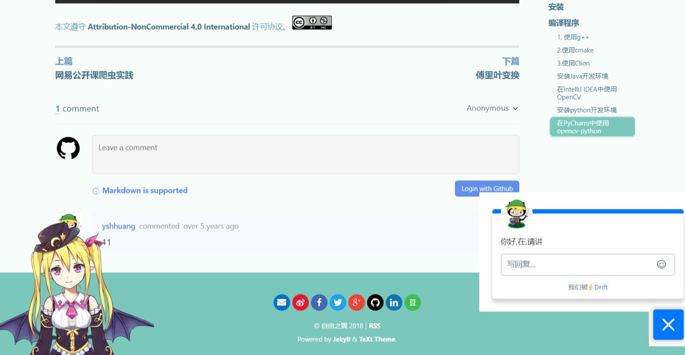

我在2018年曾经搭建过自己的博客，用的技术方案是[`Github Pages`](https://pages.github.com/)+[`jekyll`](https://jekyllrb.com/)+[`TeXt theme`](https://github.com/kitian616/jekyll-TeXt-theme)。当时也比较爱折腾，搞了一堆没啥用的小组件，像[`drift`](https://www.salesloft.com/platform/drift)、[`live2d widget`](https://github.com/stevenjoezhang/live2d-widget)、[`gitalk`](https://github.com/gitalk/gitalk/)。

后来因为工作比较忙，很久都没有更新了。最近因为10月中旬离职之后，整个人都闲了起来，这期间也学习了一些新的东西，因此想着重拾我的博客。
随着年龄和阅历的增加，我的心态也发生了一些变化。对于一个博客网站来说，最重要的还是内容，而不是那些花里胡哨的样式、组件。就像我比较喜欢的[matrix67](http://www.matrix67.com/blog/),网站运营了十几年了，还是这么的简陋，但是丝毫不影响有一批忠实粉丝在关注他，每篇文章都有不少的评论。并且，因为互联网特别是前端技术的快速发展，相较于2018年，我也有了更多的选择来搭建自己的博客网站。下面就总结一下目前主流的博客搭建方案以及我个人的选择。
## 第三方平台
在现有的博客网站、论坛或社区上注册个人主页。如知乎，掘金，简书，segmentFault，csdn，博客园，微信公众号等。
使用平台的好处是，可以免费获得推广，文章容易被更多人看到，而且几乎没什么成本。坏处就是没有自主权，很大程度上受制于平台，比如有些平台审核严格，有些文章可以发不出来；平台都有自己的一套推荐算法，真正的好内容可能没人看到，反而一些制造对立，博眼球的文章被大量推荐；有的平台可能会因为资金或者运营策略的问题，逐渐没落或者面临关停的风险。
自建博客网站可以摆脱对平台的依赖，将内容完全掌握在自己手中；还可以根据自己喜好对网站进行个性化定制。不过需要一定的技术能力，还有可能需要付出一点金钱成本。
自建博客需要用到的技术主要包括网站生成技术和网站发布，前者解决如何将博客变成网页，后者解决网站如何能被别人访问到。
## 静态网站生成技术
当前比较流行的静态网站生成技术有[Hugo](https://gohugo.io/)、[Jekyll](https://jekyllrb.com/)、[Hexo](https://hexo.io/)。这类框架生成的网站特点是加载速度快，成本低。但是无法动态更新内容，大型网站的构建时间较长。比较适合新手使用。
## 内容管理系统CMS
这方面最流行的工具非[WordPress](https://wordpress.org/)莫属。这类工具的特点是有一个后台可以管理文章、评论、主题等，功能非常全面。但是使用成本也很高，需要有数据库和后端服务器，适合博客数量比较多的人使用。
[NotionNext](https://github.com/tangly1024/NotionNext)属于比较另类的CMS，它借助[Notion](https://www.notion.so/)强大的数据库功能和开放API，无需服务器即可实现内容的动态更新和管理。既然提到notion，其实只用notion也可以实现类似的功能，只不过可定制度就很低罢了（而且notion在中国大陆的访问速度极慢），比如我用notion搭建的这个页面:https://yshhuang.notion.site/。
## 自写前端
使用前端技术，自己写一个静态网站，适合有一定代码水平的人。
## 自写前后端
自己写一个CMS，灵活度最高，难度也更大，一般适合企业采用这种方案。其实有很多企业也在用WordPress做网站，不是有很强的定制化需求，真没必要自己写。

## 我的选择
**方案对比**
|方案|技术难度|成本|灵活度|加载速度|
|--|--|--|--|--|
|第三方平台|最低|最低|最低|取决于平台|
|静态博客|低|中|低|快|
|CMS|一般|高|高|一般|
|手写前端|高|中|高|快|
|手写全栈|最高|高|最高|一般|

对于个人开发者和自媒体从业者，首先排除手写（除非你就是爱折腾）。
除了前面提到的`Hugo`,`Jekyll`,`Hexo`,`WordPress`，还有很多其他的博客生成器，用户群体相对较小。对于新手或者懒人来说，最好选择用户量较大的工具，因为用户量大的工具社区更加活跃，主题也更丰富。

**我的方案**

我选择的自建博客方案是[Astro](https://astro.build/)+[Cloudflare Pages](https://developers.cloudflare.com/pages/)，这套方案是完全免费的，非常适合个人开发者。
`Astro`是一个比较新的web框架，专为内容驱动型网站设计，并且有丰富的主题模板，可以当做静态网站生成器来使用。我选择`Astro`的主要原因是它的加载速度非常快，这点可以参考[官方文档](https://docs.astro.build/zh-cn/concepts/why-astro/#%E9%BB%98%E8%AE%A4%E5%BF%AB%E9%80%9F)的介绍。页面加载速度对于网站的用户体验和搜索引擎排名都至关重要，一个加载缓慢的网站可能会导致用户流失，降低网站的转化率和收益。
我之前的博客使用`GitHub Pages`进行托管，非常方便，但是在国内的访问速度比较慢慢。这些年也出现了很多免费的静态网站托管平台，如[Vercel](https://vercel.com/)、[Netlify](https://www.netlify.com/)等，这俩平台都有一定的免费额度，对于个人博客使用来说足够了。但是[Cloudflare Pages](https://pages.cloudflare.com/)的纯静态网站托管是完全免费的，而且[Cloudflare](https://www.cloudflare.com/)上还有很多免费服务和强大功能，被网友亲切的称为“赛博菩萨”。考虑到我以后可能还会部署其他网站，万一超过Vercel或Netlify的免费额度，还得花钱或者迁移，索性直接使用免费额度更高的Cloudflare,减少一些麻烦事。

**域名**
Cloudflare上托管网站会分配一个免费的三级域名:`xxx.pages.dev`,但是这个域名不是你自己的。如果以后这个域名被墙了，或者你想切换到其他平台部署你的网站，那么你的读者就无法找到你的博客地址。所以最好的方式是自己购买一个域名，解析到`pages.dev`,比如我的博客地址是`blog.yshhuang.top`，以后我的博客不论是换成自己的服务器部署还是换到其他平台，只需要修改域名解析就行了，博客地址永远不变。

